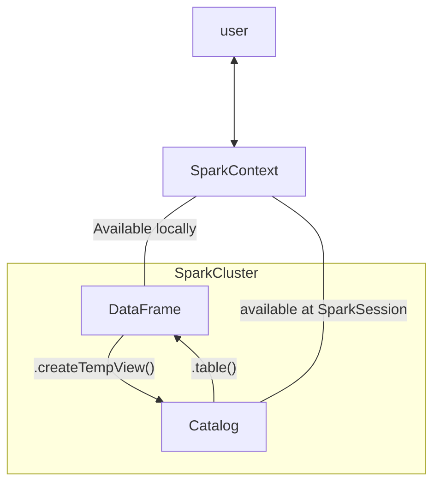

[TOC]

# 02 - recsys with pyspark

main objective: build recsys using alternating least squares in PySpark

## prerequisite - pyspark

### introduction to pyspark

pyspark similar to other distributed system has nodes, where a master node manages the splitting of data and computation. `SparkContext` is the main entrypoint that we initiate it together with `SparkConfig`. Spark's basic data structure is the Resilient Distributed Dataset (RDD) which is a low level object that allows the distributed computation. its difficult to directly work with RDD thus we uses the Spark DataFrame abstraction instead. its designed similar to SQL and is much optimized for complicated operations than RDD. there are multiple ways to achieve the same computation result where some are much faster than others. to start using Spark DF we create a `SparkSession` from `SparkContext`.

```python
from pyspark.sql import SparkSession

spark = SparkSession.builder.getOrCreate()
# we uses this instead of manually creating sparkcontext and sparkconfig
# this allows us to retrieve if there is any existing sparkcontext else create one
query = "FROM flights SELECT * LIMIT 10"
flights = spark.sql(query)
# or
flights_df = flights.toPandas()
flights.show()

# view schema
ratings.printSchema()
```



from file to spark

```python
airports = spark.read.csv(file_path, header=True)
```

### column wise operations

note pyspark dataframe is **<u>different</u>** from pandas dataframe, its immutable.

```python
# to create new columns

df = df.withColumn("newCol", df.oldCol + 1)
```

### pyspark's sql counterparts

```python
# filter - WHERE

long_flights1 = flights.filter("distance > 1000") # note extra space might not yield desired result
# or
long_flights2 = flights.filter(flights.distance > 1000)
# or
from pyspark.sql.functions import col
ratings.filter(col("userId") < 100).show()

# select - SELECT
selected1 = flights.select("tailnum", "origin", "dest")
# or flights.select(flights.tailnum, flights.origin, flights.dest)

filterA = flights.origin == "SEA"
filterB = flights.dest == "PDX"

# combined
selected2 = temp.filter(filterA).filter(filterB)

# creating new column
avg_speed = (flights.distance/(flights.air_time/60)).alias("avg_speed")
speed1 = flights.select("origin", "dest", "tailnum", avg_speed)
speed2 = flights.selectExpr("origin", "dest", "tailnum", "distance/(air_time/60) as avg_speed")

# groupBy - GROUP BY
flights.filter(flights.origin == "PDX").groupBy().min("distance").show()
```

pyspark functions

```python
import pyspark.sql.functions as F

by_month_dest = flights.groupBy("month", "dest")
by_month_dest.avg("dep_delay").show()
by_month_dest.agg(F.stddev("dep_delay")).show()
```

joining

```python
# renaming and joining

airports = airports.withColumnRenamed("faa", "dest")
flights_with_airports = flights.join(airports, how="leftouter", on="dest")
```

### pipelines

`pyspark.ml` module has `Transformer` which implements `.transform()` method and `Estimator` which implements `.fit()` method similar to `sklearn`. note pyspark only handles numerical data. casting is an important part of pyspark for better memory control and etc.

```python
# casting
model_data = model_data.withColumn("plane_year", model_data.plane_year.cast("integer"))
```

converting strings to numerical data.

```python
# StringIndexer
carr_indexer = StringIndexer(inputCol="carrier", outputCol="carrier_index")
# ohe
carr_encoder = OneHotEncoder(inputCol="carrier_index", outputCol="carrier_fact")
# vector assembler
vec_assembler = VectorAssembler(inputCols=["month", "air_time", "carrier_fact", "dest_fact", "plane_age"], outputCol="features")
```

pipelines

```python
from pyspark.ml import Pipeline

flights_pipe = Pipeline(stages=[dest_indexer, dest_encoder, carr_indexer, carr_encoder, vec_assembler])
training, test = piped_data.randomSplit([.6, .4])
piped_data = flights_pipe.fit(training).transform(training)
```

> split data after indexer, also think about how to handle the string indexer difference for future labels

### modeling and tuning

model

```python
from pyspark.ml.classification import LogisticRegression

lr = LogisticRegression()
```

evals

```python
import pyspark.ml.evaluation as evals

evaluator = evals.BinaryClassificationEvaluator(metricName="areaUnderROC")
```

tuning

```python
import pyspark.ml.tuning as tune

grid = tune.ParamGridBuilder()
grid = grid.addGrid(lr.regParam, np.arange(0, .1, .01))
grid = grid.addGrid(lr.elasticNetParam, [0, 1])
grid = grid.build()
```

train

```python
cv = tune.CrossValidator(
    estimator=lr,
    estimatorParamMaps=grid,
    evaluator=evaluator
)
models = cv.fit(training)
best_lr = models.bestModel
```

evaluate

```python
test_results = best_lr.transform(test) # note differences from sklearn
evaluator.evaluate(test)
```

## intro

there are two types of recommendation engines: content-based filtering and collaborative filtering. in recsys, there are two type of ratings, explicit eg. rating and implicit eg. user behavior. latent feature discovery, item grouping, dimensionality reduction and image compression can also be benefitted from ALS.

```python
# simple exploratory analysis
markus_ratings.groupBy("Genre").sum().show()
```

## ALS

### matrix multiplication and matrix factorization

matrix factorization essentially decomposing the matrices, the opposite of matmul. ALS uses non-negative matrix factorization. some of the mf approximation will use negative values to predict positive value however it is undesired as it does not makse sense in this context (as a latent feature). ALS works well with sparsity. it uses RMSE to calculate how far it deviates from the points available in the original matrix.

$$
R = U \cdot P
$$
`U` and `R` is held constant when `P` is adjusted, and held `U` `P` constant when `R` is adjusted. the process switches for each iteration.
$$
U \cdot P \simeq \hat{R}
$$

### data preparation for spark ALS

we first need to convert into a long dense matrix, most spark ML algorithm will requires row based format data to work with

```python
users = long_ratings.select('userId').distinct()
movies = long_ratings.select('movieId').distinct()

from pyspark.sql_functions import monotonically_increasing_id
users = users.coalesce(1) # increment by one, prevent id being repeated in different partition
movies = movies.coalesce(1)
users = users.withColumn("userIntId", monotonically_increasing_id()).persist() # persist is needed such that further modification wont modify its value
movies = movies.withColumn("userIntId", monotonically_increasing_id()).persist()

ratings_w_int_ids = long_ratings.join(users, 'userId', 'left).join(movies, 'variable', 'left')
# or
from pyspark.ml import col

ratings_data = ratings_w_int_ids.select(
    col('userIntId').alias('userId'),
    col('variable').alias('movieId'),
    col('rating')
)
```

### ALS parameters and hyperparameters

parameters: userCol, itemCol, ratingCol
hyperparameters:

- rank - number of latent features
- maxIter - number of iterations
- regParam - regularization
- alpha - for implicit ratings
- nonnegative - True
- coldStartStrategy - prevent train test split issues
- implicitPrefs - implicit or explicit rating

```python
(training_data, test_data) = ratings.randomSplit([0.8, 0.2], seed=42)

from pyspark.ml.recommendation import ALS
als = ALS(
    userCol="userId",
    itemCol="movieId",
    ratingCol="rating",
    rank=10,
    maxIter=15,
    regParam=0.1,
    coldStartStrategy="drop",
    nonnegative=True,
    implicitPrefs=False
)

model = als.fit(training_data)
test_predictions = model.transform(test_data)

from pyspark.ml.evaluation import RegressionEvaluator
evaluator = RegressionEvaluator(metricName="rmse", labelCol="ratings", predictionCol="prediction")
RMSE = evaluator.evaluate(test_predictions)
```

### real dataset (MovieLens)

$$
Sparsity = \frac{\text{Number of Ratings in Matrix}}{(\text{number of users}) * (\text{number of movies})}
$$

### performance evaluations

````python
original_ratings.filter(col("userId") == 60).sort("rating", ascending = False).show()
recommendations.filter(col("userId") == 60).show()
````

## Implicit Ratings and Million Songs Dataset

```python
users = Z.select("userId").distinct()
products = Z.select("productId").distinct()
cj = users.crossJoin(products)
Z_expanded = cj.join(Z, ["userId", "productId"], "left").fillna(0)
```

the hyperparameter alpha is used to tell me model how much each additional songs is required to add confidence. the challenge for implicit ratings is the evaluations, which we don't have the same metrics. we only have the implicit rating confidence. instead we use ROEM, rank ordering error metric
$$
ROEM = \frac{\sum_{u, i}{r^t_{u, i} rank_{u, i}}}{\sum_{u, i}{r^t_{u, i}}}
$$
basically it checks if the songs with higher number of plays have higher predictions. ROEM is not provided in spark we need to build manually. note manual algorithms's need to be implemented such that other operation in the pipeline eg. cross validation, grid search are compatible.

```python
for r in ranks:
    for mi in maxIters:
        for rp in regParams:
            for a in alphas:
                model_list.append(ALS(userCol= "userId", itemCol= "songId", ratingCol= "num_plays", rank = r, maxIter = mi, regParam = rp, alpha = a, coldStartStrategy="drop", nonnegative = True, implicitPrefs = True))
print(model_list, "Length of model_list: ", len(model_list))
assert len(model_list) == (len(ranks)*len(maxIters)*len(regParams)*len(alphas))

(training, test) = msd.randomSplit([0.8, 0.2])
train1, train2, train3, train4, train5 = training.randomSplit([0.2, 0.2, 0.2, 0.2, 0.2], seed = 1)
fold1 = train2.union(train3).union(train4).union(train5)
fold2 = train3.union(train4).union(train5).union(train1)
fold3 = train4.union(train5).union(train1).union(train2)
fold4 = train5.union(train1).union(train2).union(train3)
fold5 = train1.union(train2).union(train3).union(train4)

foldlist = [(fold1, train1), (fold2, train2), (fold3, train3), (fold4, train4), (fold5, train5)]
ROEMS = []
for model in model_list:
    for ft_pair in foldlist:
        fitted_model = model.fit(ft_pair[0])
        predictions = fitted_model.transform(ft_pair[1])
        r = ROEM(predictions)
        print("ROEM: ", r)
    v_fitted_model = model.fit(training)
    v_predictions = v_fitted_model.transform(test)
    v_ROEM = ROEM(v_predictions)
    ROEMS.append(v_ROEM)
    print("Validation ROEM: ", v_ROEM)
```

### binary implicit ratings

in some situation we only have information of if the user have or not done some action, but without information how many times or how much they actually like them, we can still feed binary data into ALS with ROEM. ALS can still make meaningful predictions. note if we uses explicit mode for ALS it will predict everything as 1 to ensure RMSE is 0. also we are dealing with imbalanced dataset here (check sparsity) however ROEM is not affected like it would on RMSE. some tricks we can use eg. item weighting, instead of putting unseen movies 0, we can weight them higher if lots of people have seen them with the assumption if more people like it, it should be good (duh...), or user weighting, where user that seen lots of movies will have lower weights to unseen movies.

___

## reference

- [manual implementation of utils functions](https://github.com/jamenlong/ALS_expected_percent_rank_cv)
- [item weighting?](http://yifanhu.net/PUB/cf.pdf)
- [user weighting?](http://citeseerx.ist.psu.edu/viewdoc/download?doi=10.1.1.306.4684&rep=rep1&type=pdf)
