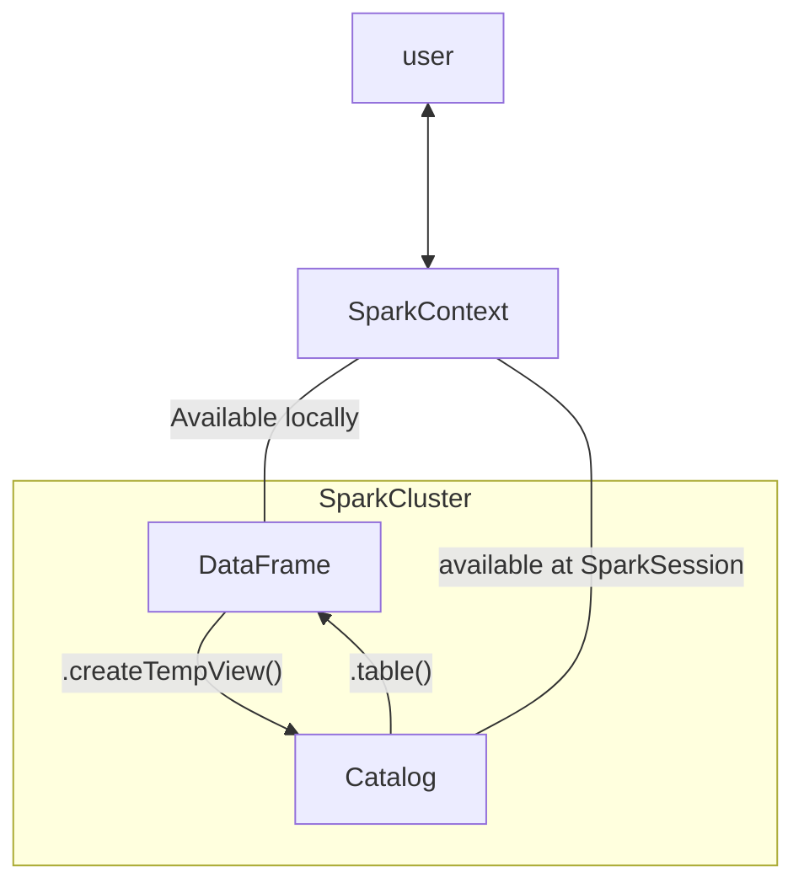

[TOC]

# 02 - recsys with pyspark

main objective: build recsys using alternating least squares in PySpark

## prerequisite - pyspark

### introduction to pyspark

pyspark similar to other distributed system has nodes, where a master node manages the splitting of data and computation. `SparkContext` is the main entrypoint that we initiate it together with `SparkConfig`. Spark's basic data structure is the Resilient Distributed Dataset (RDD) which is a low level object that allows the distributed computation. its difficult to directly work with RDD thus we uses the Spark DataFrame abstraction instead. its designed similar to SQL and is much optimized for complicated operations than RDD. there are multiple ways to achieve the same computation result where some are much faster than others. to start using Spark DF we create a `SparkSession` from `SparkContext`.

```python
from pyspark.sql import SparkSession

spark = SparkSession.builder.getOrCreate()
# we uses this instead of manually creating sparkcontext and sparkconfig
# this allows us to retrieve if there is any existing sparkcontext else create one
query = "FROM flights SELECT * LIMIT 10"
flights = spark.sql(query)
# or
flights_df = flights.toPandas()
flights.show()
```



from file to spark

```python
airports = spark.read.csv(file_path, header=True)
```

### column wise operations

note pyspark dataframe is **<u>different</u>** from pandas dataframe, its immutable.

```python
# to create new columns

df = df.withColumn("newCol", df.oldCol + 1)
```

### pyspark's sql counterparts

```python
# filter - WHERE

long_flights1 = flights.filter("distance > 1000") # note extra space might not yield desired result
#or
long_flights2 = flights.filter(flights.distance > 1000)

# select - SELECT
selected1 = flights.select("tailnum", "origin", "dest")
# or flights.select(flights.tailnum, flights.origin, flights.dest)

filterA = flights.origin == "SEA"
filterB = flights.dest == "PDX"

# combined
selected2 = temp.filter(filterA).filter(filterB)

# creating new column
avg_speed = (flights.distance/(flights.air_time/60)).alias("avg_speed")
speed1 = flights.select("origin", "dest", "tailnum", avg_speed)
speed2 = flights.selectExpr("origin", "dest", "tailnum", "distance/(air_time/60) as avg_speed")

# groupBy - GROUP BY
flights.filter(flights.origin == "PDX").groupBy().min("distance").show()
```

pyspark functions

```python
import pyspark.sql.functions as F

by_month_dest = flights.groupBy("month", "dest")
by_month_dest.avg("dep_delay").show()
by_month_dest.agg(F.stddev("dep_delay")).show()
```

joining

```python
# renaming and joining

airports = airports.withColumnRenamed("faa", "dest")
flights_with_airports = flights.join(airports, how="leftouter", on="dest")
```

### pipelines

`pyspark.ml` module has `Transformer` which implements `.transform()` method and `Estimator` which implements `.fit()` method similar to `sklearn`. note pyspark only handles numerical data. casting is an important part of pyspark for better memory control and etc.

```python
# casting
model_data = model_data.withColumn("plane_year", model_data.plane_year.cast("integer"))
```

converting strings to numerical data.

```python
# StringIndexer
carr_indexer = StringIndexer(inputCol="carrier", outputCol="carrier_index")
# ohe
carr_encoder = OneHotEncoder(inputCol="carrier_index", outputCol="carrier_fact")
# vector assembler
vec_assembler = VectorAssembler(inputCols=["month", "air_time", "carrier_fact", "dest_fact", "plane_age"], outputCol="features")
```

pipelines

```python
from pyspark.ml import Pipeline

flights_pipe = Pipeline(stages=[dest_indexer, dest_encoder, carr_indexer, carr_encoder, vec_assembler])
training, test = piped_data.randomSplit([.6, .4])
piped_data = flights_pipe.fit(training).transform(training)
```

> split data after indexer, also think about how to handle the string indexer difference for future labels

### modeling and tuning

model

```python
from pyspark.ml.classification import LogisticRegression

lr = LogisticRegression()
```

evals

```python
import pyspark.ml.evaluation as evals

evaluator = evals.BinaryClassificationEvaluator(metricName="areaUnderROC")
```

tuning

```python
import pyspark.ml.tuning as tune

grid = tune.ParamGridBuilder()
grid = grid.addGrid(lr.regParam, np.arange(0, .1, .01))
grid = grid.addGrid(lr.elasticNetParam, [0, 1])
grid = grid.build()
```

train

```python
cv = tune.CrossValidator(
    estimator=lr,
    estimatorParamMaps=grid,
    evaluator=evaluator
)
models = cv.fit(training)
best_lr = models.bestModel
```

evaluate

```python
test_results = best_lr.transform(test) # why not fit?
evaluator.evaluate(test)
```

## intro

there are two types of recommendation engines: content-based filtering and collaborative filtering. in recsys, there are two type of ratings, explicit eg. rating and implicit eg. user behavior. latent feature discovery, item grouping, dimensionality reduction and image compression can also be benefitted from ALS.

```python
# simple exploratory analysis
markus_ratings.groupBy("Genre").sum().show()
```

## ALS

### matrix multiplication

### matrix factorization